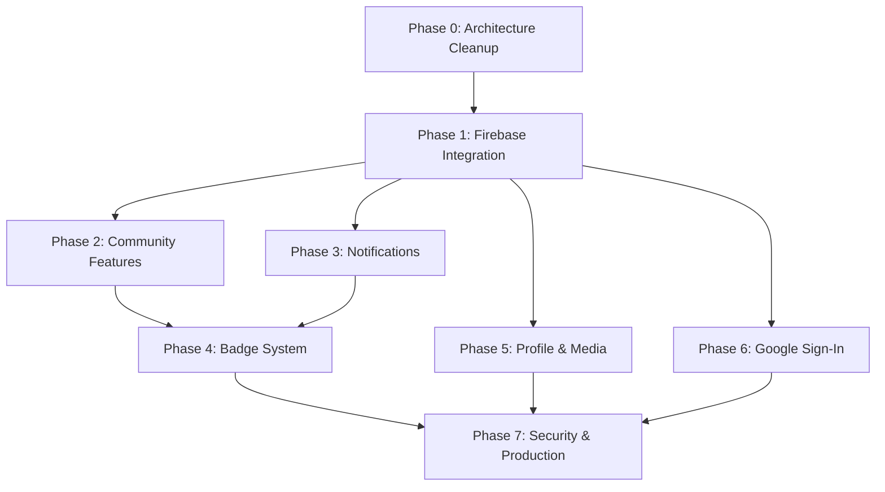

# Implementation Plan — AlertZone Mobile App

> **⚠️ Agents**: Work through phases in order. Do NOT skip phases unless explicitly instructed. Update `CURRENT_STATUS.md` after completing each task.

---

## Phase 0: Architecture Cleanup 🏗️

**Goal**: Restructure the codebase to match the target architecture before adding any new features. No functionality changes — only code organization.

**Priority**: 🔴 CRITICAL — Must be done first.

### Task 0.1: Create Directory Structure
- [ ] Create `components/ui/`, `components/report/`, `components/home/`, `components/profile/`, `components/map/`
- [ ] Create `hooks/`
- [ ] Create `types/`
- [ ] Create `constants/`
- [ ] Create `utils/`
- [ ] Create `context/`

### Task 0.2: Extract Type Definitions
- [ ] Create `types/user.ts` — move `UserProfile` interface from `config/authConfig.tsx`
- [ ] Create `types/report.ts` — define `Report`, `ReportStatus`, `ReportCategory`, `ReportLocation`
- [ ] Create `types/notification.ts` — define `Notification` interface
- [ ] Create `types/badge.ts` — define `Badge`, `BadgeCriteria`
- [ ] Create `types/index.ts` — re-export all types
- [ ] Update `authConfig.tsx` to import `UserProfile` from `types/user.ts`

### Task 0.3: Extract Constants
- [ ] Create `constants/colors.ts` — extract all color values from screens
- [ ] Create `constants/categories.ts` — move CATEGORIES from `home.tsx` and `report.tsx`
- [ ] Create `constants/statuses.ts` — move `STATUS_CONFIG` from `history.tsx`
- [ ] Create `constants/badges.ts` — move `BADGES` from `profile.tsx`
- [ ] Create `constants/layout.ts` — common spacing/sizing values
- [ ] Update all screens to import from `constants/`

### Task 0.4: Move Context Providers
- [ ] Move `config/authConfig.tsx` → `context/AuthContext.tsx`
- [ ] Move `config/tabBarScrollContext.tsx` → `context/ScrollContext.tsx`
- [ ] Keep `config/toastConfig.tsx` in `config/` (it's config, not context)
- [ ] Update all imports across the project

### Task 0.5: Extract Shared Components
- [ ] Extract `SectionHeader` from `home.tsx` → `components/ui/SectionHeader.tsx`
- [ ] Extract `CategoryChip` from `home.tsx` → `components/home/CategoryChip.tsx`
- [ ] Extract `NearbyCard` from `home.tsx` → `components/home/NearbyCard.tsx`
- [ ] Extract `UpdateRow` from `home.tsx` → `components/home/UpdateRow.tsx`
- [ ] Extract `HeroBanner` from `home.tsx` → `components/home/HeroBanner.tsx`
- [ ] Extract `ReportCard` from `history.tsx` → `components/report/ReportCard.tsx`
- [ ] Extract `ReportDetailModal` from `history.tsx` → `components/report/ReportDetailModal.tsx`
- [ ] Extract `CategoryModal` from `report.tsx` → `components/report/CategoryPicker.tsx`
- [ ] Extract `SuccessScreen` from `report.tsx` → `components/report/SuccessScreen.tsx`
- [ ] Extract `StatCard` from `profile.tsx` → `components/profile/StatCard.tsx`
- [ ] Extract `BadgeChip` from `profile.tsx` → `components/profile/BadgeChip.tsx`
- [ ] Extract `SettingsRow` from `profile.tsx` → `components/profile/SettingsRow.tsx`
- [ ] Extract `EditModal` from `profile.tsx` → `components/profile/EditProfileModal.tsx`
- [ ] Extract `LogoutModal` from `profile.tsx` → `components/profile/LogoutModal.tsx`
- [ ] Update screen files to import from `components/`

### Task 0.6: Fix Known Bugs
- [ ] Fix wrong icon on password field in `signupScreen.tsx` (line 234: `call-outline` → `lock-closed-outline`)
- [ ] Fix `@ts-ignore` on firebase auth import — add proper type assertion
- [ ] Verify `expo-blur` is in `package.json` (used in signup modal)
- [ ] Move Google Maps API keys out of `app.json` into env variables

### Task 0.7: Commit & Verify
- [ ] Run `npx expo start` to verify no import errors
- [ ] Test login → home → map → report → history → profile flow
- [ ] Commit: `refactor: restructure project to layered architecture`
- [ ] Update `CURRENT_STATUS.md` — mark Phase 0 as ✅ Complete

---

## Phase 1: Firebase Service Layer & Core Integration 🔥

**Goal**: Build the service layer, wire reports to Firestore, and enable real report submission.

**Priority**: 🔴 HIGH

### Task 1.1: Build Service Layer
- [ ] Create `services/auth.service.ts` — wrap login, signup, google sign-in, password reset
- [ ] Create `services/report.service.ts`:
  - `createReport(data)` — add to Firestore `reports` collection
  - `getReportsByUser(uid)` — query user's reports
  - `getReportById(id)` — single report fetch
  - `getNearbyReports(lat, lng, radiusKm)` — geo-based query
  - `subscribeToReports(uid, callback)` — real-time listener
  - `updateReportStatus(id, status)` — admin use (from dashboard)
- [ ] Create `services/user.service.ts`:
  - `getUserProfile(uid)` — fetch profile
  - `updateUserProfile(uid, data)` — update profile fields
  - `incrementContributionPoints(uid, amount)` — add points
- [ ] Create `services/storage.service.ts`:
  - `uploadReportImage(reportId, uri)` — upload to Storage
  - `uploadAvatar(uid, uri)` — upload profile picture
  - `deleteImage(path)` — remove from Storage

### Task 1.2: Build Custom Hooks
- [ ] Create `hooks/useReports.ts` — subscribe to user's reports from Firestore
- [ ] Create `hooks/useNearbyReports.ts` — fetch reports near user's location
- [ ] Create `hooks/useSubmitReport.ts` — report submission with image upload
- [ ] Create `hooks/useLocation.ts` — wrap expo-location permissions + current position
- [ ] Create `hooks/useImagePicker.ts` — wrap expo-image-picker for camera/gallery

### Task 1.3: Wire Report Submission (report.tsx)
- [ ] Install `expo-image-picker`
- [ ] Enable Firebase Storage in Firebase Console
- [ ] Wire photo/video buttons to `useImagePicker`
- [ ] Wire location section to `useLocation` (show real address + map pin)
- [ ] Wire MapView in report form to show user's current location
- [ ] Wire Submit button to `useSubmitReport` → creates Firestore doc + uploads images
- [ ] Display real Firestore document ID as reference
- [ ] Commit: `feat: wire report submission to Firestore + Storage`

### Task 1.4: Wire Report History (history.tsx)
- [ ] Replace `MOCK_REPORTS` with `useReports` hook (real-time Firestore data)
- [ ] Wire filter tabs to Firestore queries
- [ ] Wire ReportDetailModal to show real data
- [ ] Commit: `feat: wire report history to Firestore`

### Task 1.5: Wire Home Screen (home.tsx)
- [ ] Replace `NEARBY_ISSUES` with `useNearbyReports` hook
- [ ] Replace `LATEST_UPDATES` with real recent activity from Firestore
- [ ] Wire "View My Reports" button to history tab
- [ ] Wire notification bell count to real unread count
- [ ] Commit: `feat: wire home screen to Firestore`

### Task 1.6: Wire Map Screen (map.tsx)
- [ ] Replace `MOCK_PINS` with Firestore real-time subscription
- [ ] Wire filter chips to Firestore category queries
- [ ] Wire "DETAILS" button to report detail navigation
- [ ] Commit: `feat: wire map to Firestore real-time data`

### Task 1.7: Commit & Update Status
- [ ] Full flow test: Register → Login → Submit Report → View in History → See on Map
- [ ] Commit: `feat: complete Phase 1 — Firebase integration`
- [ ] Update `CURRENT_STATUS.md`

---

## Phase 2: Community Features 🤝

**Goal**: Enable upvoting, area-based feeds, and community engagement.

### Task 2.1: Upvoting System
- [ ] Design upvote data model (see `FIRESTORE_DATA_MODEL.md` — `upvotes` subcollection)
- [ ] Create `hooks/useUpvote.ts` — toggle upvote, check if already upvoted
- [ ] Wire upvote button in ReportDetailModal
- [ ] Wire upvote count display on ReportCard
- [ ] Prevent self-upvoting (can't upvote own report)
- [ ] Commit: `feat: add community upvoting system`

### Task 2.2: Area-Based Filtering
- [ ] Add area/district field to user registration
- [ ] Filter home feed and nearby reports by user's area
- [ ] Show reports from same area on map by default
- [ ] Commit: `feat: add area-based report filtering`

---

## Phase 3: Notifications 🔔

**Goal**: Implement push notifications for report status changes.

### Task 3.1: FCM Setup
- [x] Install `expo-notifications` ✅
- [x] Add `expo-notifications` plugin to `app.json` with icon, color, and default channel ✅
- [x] Add Android `POST_NOTIFICATIONS`, `RECEIVE_BOOT_COMPLETED`, `VIBRATE` permissions ✅
- [x] Create `services/notification.service.ts` — Android channel setup (`alertzone-alerts`) before token fetch, FCM token registration ✅
- [x] Store FCM/Expo Push Token in user's Firestore document (`expoPushToken` + `fcmToken`) ✅
- [x] Create `hooks/useNotifications.ts` — permission request, token registration, foreground + tap listeners ✅

### Task 3.2: Status Change Notifications
- [ ] Create Firebase Cloud Function: on report status change → send push notification
- [ ] Notification payload: report title, new status, reference ID
- [x] Handle notification tap → navigate to report detail (map tab with reportId param) ✅

### Task 3.3: In-App Notification Center
- [x] Build notification list screen (`app/notifications.tsx`) ✅
- [x] Wire notification bell badge to unread count ✅
- [ ] Create `notifications` Firestore collection (currently using existing structure)
- [ ] Commit: `feat: add push notifications for report updates`

---

## Phase 4: Badge & Gamification System 🏅

**Goal**: Implement real badge calculation and display.

### Task 4.1: Badge Logic
- [ ] Create `hooks/useUserBadges.ts` — compute badges from user activity
- [ ] Badge criteria:
  - **First Responder**: first report submitted
  - **Early Bird**: first reporter in a new location area
  - **Community Hero**: 50+ total upvotes received
  - **Mapper**: reports in 5+ unique locations
  - **Watchdog**: 10+ validated (resolved) reports
  - **Trend Setter**: single report with 100+ upvotes
  - **Consistent Reporter**: weekly report for 4 consecutive weeks
- [ ] Store earned badges in user profile
- [ ] Display real badges on profile screen (replace hardcoded array)

### Task 4.2: Contribution Points & Levels
- [ ] Define point system:
  - Submit report: +10 pts
  - Report validated (resolved): +25 pts
  - Receive upvote: +2 pts
  - Earn badge: +50 pts
- [ ] Define level thresholds: L1 (0), L2 (100), L3 (300), L4 (600), L5 (1000)
- [ ] Auto-calculate and update level in Firestore
- [ ] Display level on profile screen
- [ ] Commit: `feat: add badge system and contribution points`

---

## Phase 5: Profile & Media Enhancements 📸

**Goal**: Complete profile features and media handling.

### Task 5.1: Avatar Upload
- [x] Wire camera button on profile to `expo-image-picker` ✅
- [x] Upload avatar to Firebase Storage via `storage.service.ts` ✅
- [x] Store avatar URL in user profile ✅
- [x] Display real avatar across all screens ✅

### Task 5.2: Report Media
- [ ] Display uploaded images in report detail modal
- [ ] Support multiple images per report (up to 3)
- [ ] Image zoom/preview on tap

### Task 5.3: Commit
- [ ] Commit: `feat: add avatar upload and report media display`

---

## Phase 6: Google Sign-In 🔐

**Goal**: Enable Google Sign-In as an alternative auth method.

> **Note**: This is explicitly planned for a separate phase.

### Task 6.1: Setup
- [ ] Install `@react-native-google-signin/google-signin`
- [ ] Configure OAuth client in Google Cloud Console
- [ ] Configure Firebase Auth Google provider
- [ ] Wire Google button in login and signup screens
- [ ] Handle first-time Google sign-in (create Firestore profile)
- [ ] Commit: `feat: add Google Sign-In`

---

## Phase 7: Firestore Security & Production Readiness 🔒

**Goal**: Secure the database and prepare for deployment.

### Task 7.1: Security Rules
- [ ] Write Firestore security rules:
  - Users: read own, write own (except role)
  - Reports: create by authenticated users, read by area, update status by admins only
  - Upvotes: one per user per report
- [ ] Test rules with Firebase Emulator

### Task 7.2: Data Validation
- [ ] Add input validation for all forms
- [ ] Add Firestore data validation rules
- [ ] Rate limiting on report submission

### Task 7.3: Environment Security
- [ ] Ensure `.env` is in `.gitignore`
- [ ] Restrict Google Maps API key (per package name)
- [ ] Remove API keys from `app.json`

### Task 7.4: Performance
- [ ] Add pagination to report lists
- [ ] Optimize image sizes before upload
- [ ] Add Firestore composite indexes for common queries

### Task 7.5: Final Commit
- [ ] Commit: `chore: add security rules and production hardening`
- [ ] Update `CURRENT_STATUS.md` — mark all phases complete

---

## Phase Dependencies

---

## Effort Estimates

| Phase | Estimated Effort | Complexity |
|---|---|---|
| Phase 0: Architecture Cleanup | 3-4 hours | Low (mechanical refactoring) |
| Phase 1: Firebase Integration | 8-12 hours | Medium-High (core feature work) |
| Phase 2: Community Features | 4-6 hours | Medium |
| Phase 3: Notifications | 6-8 hours | High (Cloud Functions + FCM) |
| Phase 4: Badge System | 4-6 hours | Medium |
| Phase 5: Profile & Media | 3-4 hours | Low-Medium |
| Phase 6: Google Sign-In | 3-4 hours | Medium (OAuth config) |
| Phase 7: Security & Production | 4-6 hours | Medium-High |

**Total Estimated: 35-50 hours**
